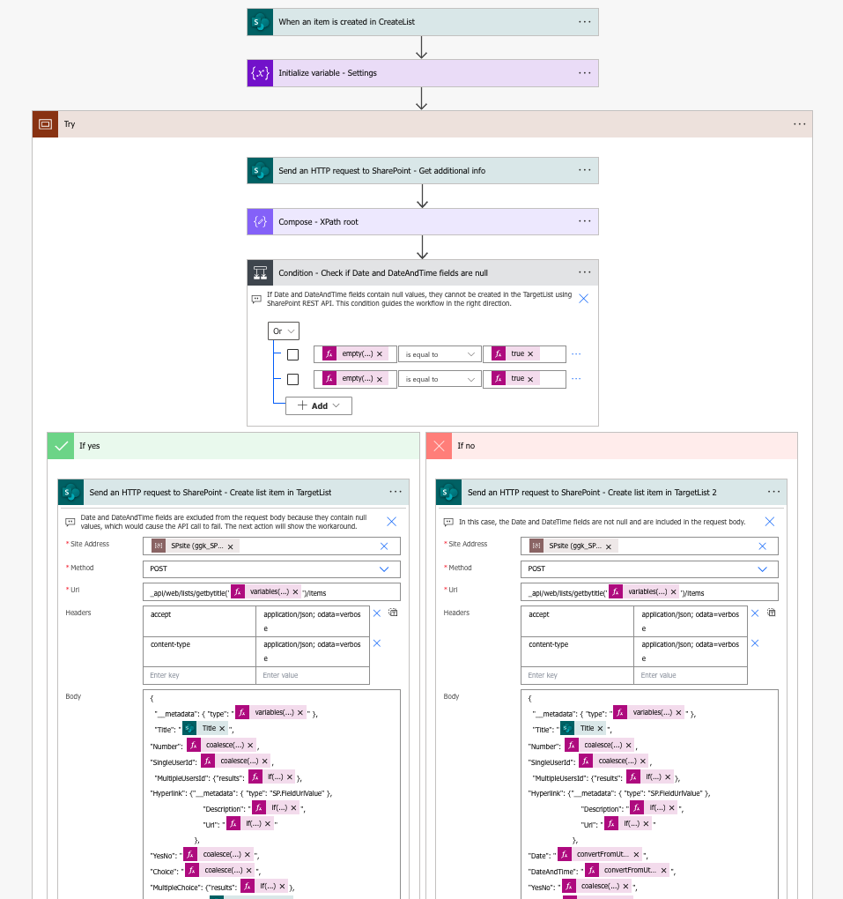

# SharePoint REST API Crud Operations in Power Automate

## Summary

This sample solution covers CRUD operations when using SharePoint REST API inside Power Automate.

## Flows

* create-item-in-another-list (available)
* update-item-in-another-list (coming soon)

#### create-item-in-another-list
This flow illustrates the process of creating a new list item in a secondary list (Target List) from a source list (CreateList) using the 'Send an HTTP request to SharePoint' action in Power Automate. It covers commonly used fields including: Content Type, Date, Date and Time, Hyperlink, Multi-select Choice, Multi-select People Picker, Number, Single Choice, Single Line of Text, Single People Picker, and Yes/No. Additionally, this flow can handle null values from these fields efficiently.

This sample workflow is intended to serve as a valuable reference for interacting with the SharePoint REST API within Power Automate.



***update-item-in-another-list (coming soon)***

## Applies to

* [Microsoft Power Automate](https://docs.microsoft.com/power-automate/)

## Compatibility


## Authors

Solution|Author(s)
--------|---------
crud-sharepoint-rest-api | [Gabriel Koolman](https://www.linkedin.com/in/gabrielkoolman/)

## Version history

Version|Date|Comments
-------|----|--------
1.0|October 22, 2023|Initial release

## Minimal Path to Awesome

* Create a new SharePoint list and name it "CreateList"
* Add the required columns (you can find the column names and types [here](assets/sp-column-config.json))
* Using "CreateList" as a template, create a new SharePoint list and name it "TargetList"
* [Download](solution/crud-sharepoint-rest-api.zip) the `.zip` file from the `solution` folder
* Import the solution by going to the [Power Automate Portal](https://make.powerautomate.com) and clicking on **"Import Solution"**
* Configure the (4) environment variables (the SharePoint site, CreateList, TargetList and JSON settings)
* Turn on the flow

## Using the Source Code

You can also use the [Power Platform CLI](https://docs.microsoft.com/powerapps/developer/data-platform/powerapps-cli) to pack the source code by following these steps::

* Clone the repository to a local drive
* Pack the source files back into a solution `.zip` file:
  ```bash
  pac solution pack --zipfile pathtodestinationfile --folder pathtosourcefolder
  ```
  Making sure to replace `pathtosourcefolder` to point to the path to this sample's `sourcecode` folder, and `pathtodestinationfile` to point to the path of this solution's `.zip` file (located under the `solution` folder)
* Import the solution by going to the [Power Automate Portal](https://make.powerautomate.com) and clicking on **"Import Solution"**

## Disclaimer

**THIS CODE IS PROVIDED *AS IS* WITHOUT WARRANTY OF ANY KIND, EITHER EXPRESS OR IMPLIED, INCLUDING ANY IMPLIED WARRANTIES OF FITNESS FOR A PARTICULAR PURPOSE, MERCHANTABILITY, OR NON-INFRINGEMENT.**