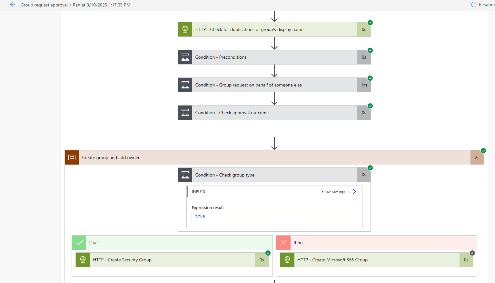
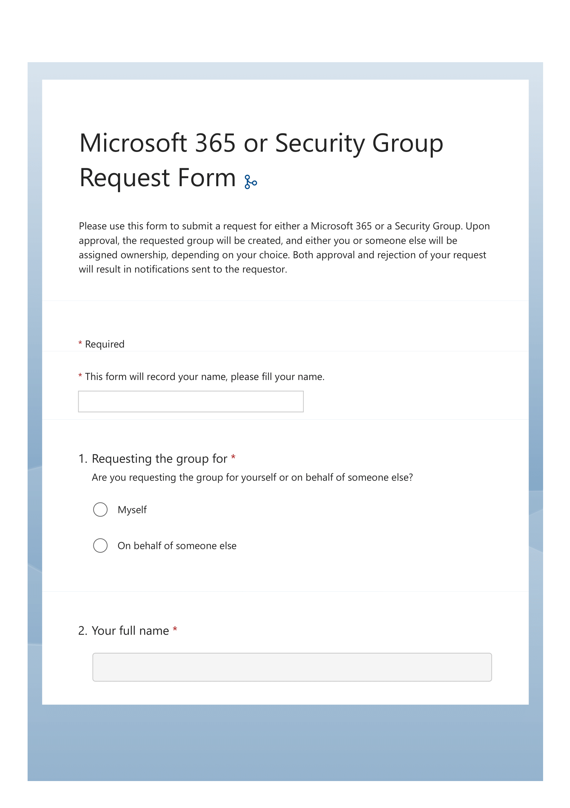
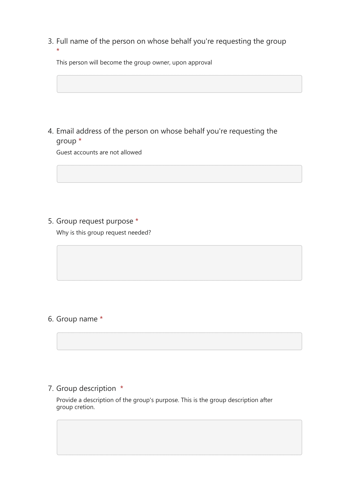
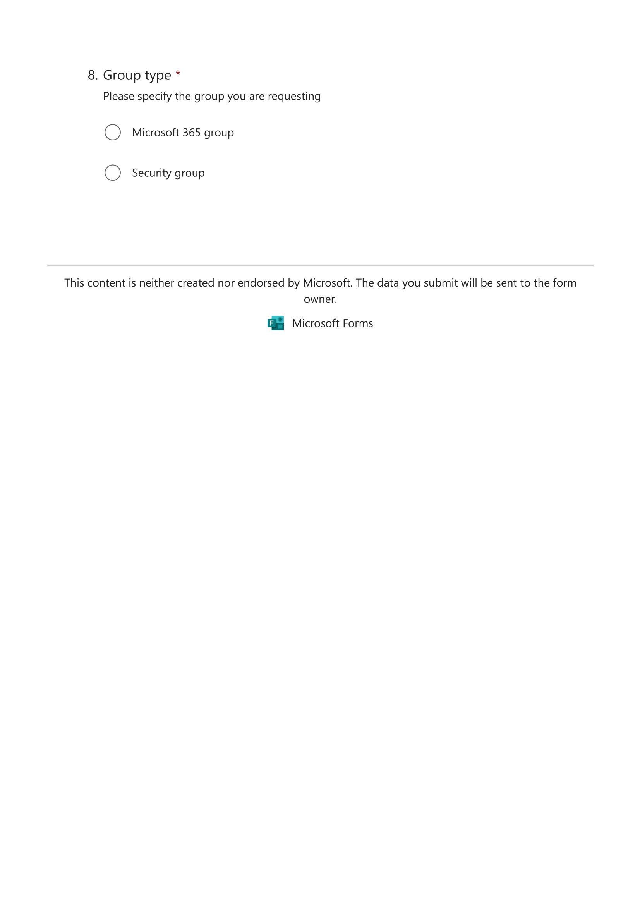
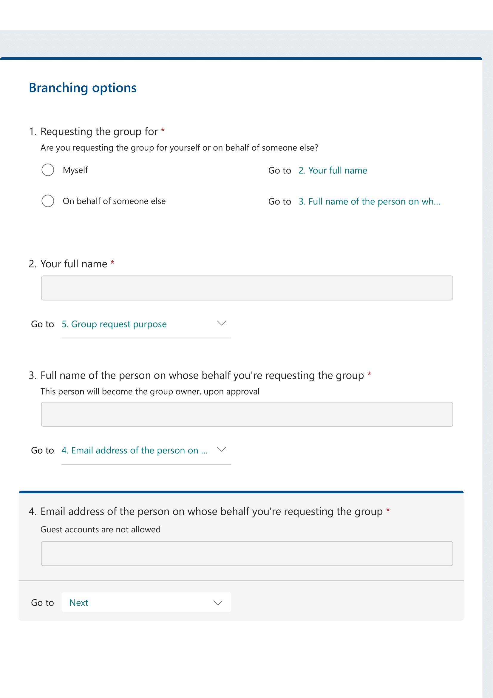
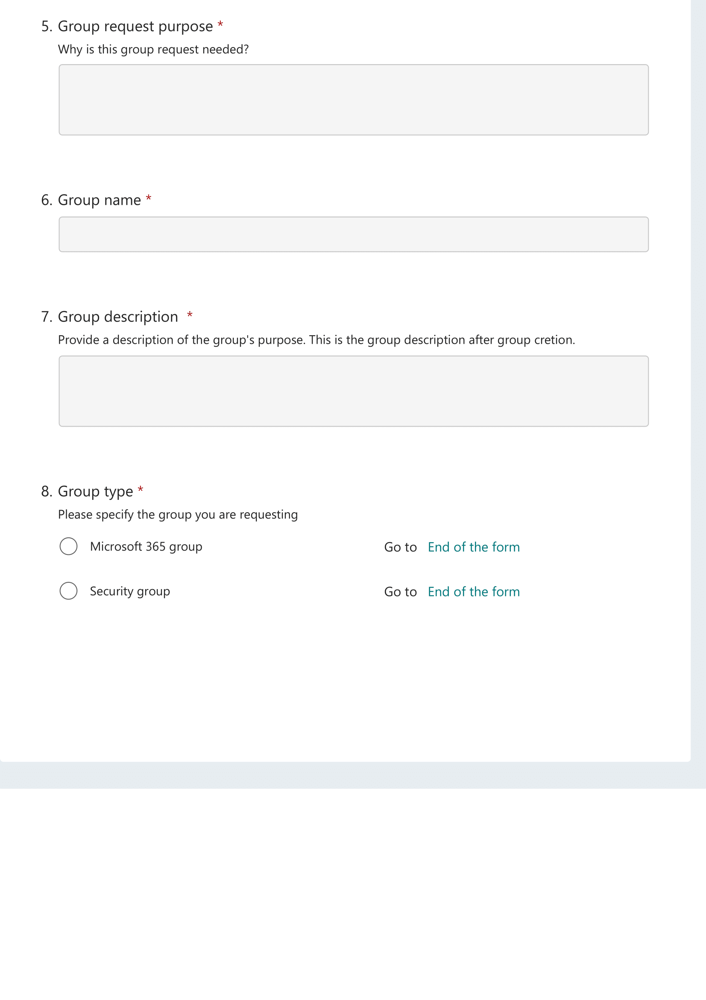

# Security Group & M365 Group Requests Automation 

## Summary

This sample solution shows you how to automate security group and Microsoft 365 group requests using Power Automate, Microsoft Form and Microsoft Graph API with Application User permissions.





## Applies to

* [Microsoft Power Automate](https://docs.microsoft.com/power-automate/)
* [Microsoft Graph](https://learn.microsoft.com/en-us/graph/)
## Compatibility


## Authors

Solution|Author(s)
--------|---------
group-requests-automation-graph | [Gabriel Koolman](https://www.linkedin.com/in/gabrielkoolman/)

## Version history

Version|Date|Comments
-------|----|--------
1.0|September 10, 2023|Initial release

## Setup this solution

# Preparations


#### Create app registration with application user permissions


1\. Navigate to [https://entra.microsoft.com/](https://entra.microsoft.com/#home)


2\. Click on Applications and open "App registrations"


3\. Click on + New registration


4\. Enter a name for your application and click on "Register". I called mine Manage groups.


5\. Click "API permissions"


6\. Click "Add a permission"


7\. Click "Microsoft Graph"


8\. Click "Application permissions"

Your application runs as a background service or daemon without a signed-in user.


9\. Click the "Search box" field.


10\. Select **"User.Read.All"**


11\. Select **"Group.ReadWrite.All"** and also **"GroupMember.ReadWrite.All"**


12\. Select **"RoleManagement.ReadWrite.Directory"**


13\. Click **"Grant admin consent for.."**


14\. Click "Yes"


15\. After the admin has given consent, you'll notice green check marks indicating that the application is allowed to use the permissions given.


16\. Click "Certificates & secrets"


17\. Click  + New client secret


18\. Use a **description** if you want and set an **expiration date** that aligns with your requirements. For this demo I've selected an expiration date of 24 months.


19\. Make sure to note down the client secret immediately, as you won't be able to view it again once you navigate away from this page. If lose the client secret, you'll need to generate a new one.\
\
The "Value" is the client secret that you need to store.


20\. Congratulations, the app registration process is now successfully finished.


#### Now let's setup the Microsoft Form

**First go to https://forms.office.com/ to create the form for the solution.**

Next follow the steps as on the images and create the questions while mainting the same order. We'll adjust the form branching options at the end.




**Now edit the branching using this setup.**



## Now let's download and import the solution.
* [Download](solution/group-request-automation-graph-api.zip) the `.zip` from the `solution` folder
* Go to https://make.powerautomate.com/
* [Import](https://learn.microsoft.com/en-us/power-apps/maker/data-platform/import-update-export-solutions/) the `.zip` file using **Import solution** within Microsoft Power Automate Studio.

* After downloading and importing the flow: 
1) Open the trigger and the Get Response Details action, then select the form you created earlier. Using the environment variable 'FormID' is optional. It's best practice to use a datatype environment variable instead.
2) Proceed to update the following actions: **Authentication, Get additional information about requestor, Response details and Admin email**. 

## Using the Source Code

You can also use the [Power Platform CLI](https://docs.microsoft.com/powerapps/developer/data-platform/powerapps-cli) to pack the source code by following these steps::

* Clone the repository to a local drive
* Pack the source files back into a solution `.zip` file:
  ```bash
  pac solution pack --zipfile pathtodestinationfile --folder pathtosourcefolder
  ```
  Making sure to replace `pathtosourcefolder` to point to the path to this sample's `sourcecode` folder, and `pathtodestinationfile` to point to the path of this solution's `.zip` file (located under the `solution` folder)
* [Import](https://learn.microsoft.com/en-us/power-apps/maker/data-platform/import-update-export-solutions/) the `.zip` file using **Import solution** within Microsoft Power Automate Studio.

## Disclaimer

**THIS CODE IS PROVIDED *AS IS* WITHOUT WARRANTY OF ANY KIND, EITHER EXPRESS OR IMPLIED, INCLUDING ANY IMPLIED WARRANTIES OF FITNESS FOR A PARTICULAR PURPOSE, MERCHANTABILITY, OR NON-INFRINGEMENT.**
