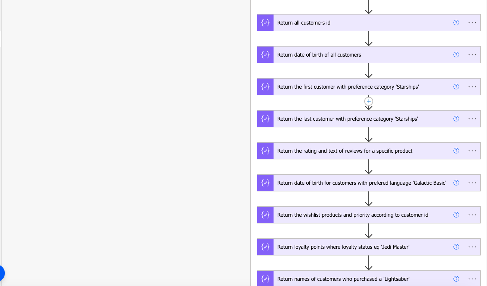

# Working with XPath expressions

## Summary

When working with REST APIs, the response can be an array of objects in JSON format. To manipulate this JSON data, you can use actions such as the **'Select'** action and **'Filter Array'** action, **'Parse JSON'** action or simply utilize **'expressions'**. However, this approach can be very challenging, especially if the JSON structure is complex or deeply nested. This is where converting the JSON data into XML becomes a valuable approach. XML's hierarchical and standardized format can often be easier to navigate compared to JSON. Additionally, once your data is in XML format, you can employ XPath expressions to adeptly query and extract specific elements and attributes, offering a refined and versatile method to process the information.

This flow will do the following:
 - We'll start by converting the JSON data to XML. 
 - Once in XML format, we'll use XPath expressions to query the data effectively. 
 - Finally the output data will be converted back to JSON format for subsequent use within the flow.




## Applies to

* [Microsoft Power Automate](https://docs.microsoft.com/power-automate/)

## Compatibility


## Authors

Solution|Author(s)
--------|---------
working-with-xpath-expressions | [Gabriel Koolman](https://www.linkedin.com/in/gabrielkoolman/)

## Version history

Version|Date|Comments
-------|----|--------
1.0|September 1, 2023|Initial release

## Features

This sample illustrates the following concepts:

* Convert complex JSON structures to XML format
* Apply various XPath expressions on the XML and return the results in JSON format

## Minimal Path to Awesome

* [Download](solution/working-with-xpath-expressions.zip) the `.zip` from the `solution` folder
* [Download](assets/sample.json) the `sample.json` from the `assets` folder
* [Import](https://flow.microsoft.com/en-us/blog/import-export-bap-packages/) the `.zip` file using **My Flows** > **Import** > **Upload** within Microsoft Flow.

## Using the Source Code

You can also use the [Power Apps CLI](https://docs.microsoft.com/powerapps/developer/data-platform/powerapps-cli) to pack the source code by following these steps::

* Clone the repository to a local drive
* Pack the source files back into a solution `.zip` file:
  ```bash
  pac solution pack --zipfile pathtodestinationfile --folder pathtosourcefolder --processCanvasApps
  ```
  Making sure to replace `pathtosourcefolder` to point to the path to this sample's `sourcecode` folder, and `pathtodestinationfile` to point to the path of this solution's `.zip` file (located under the `solution` folder)
* Within **Power Automate Studio**, import the `.zip` file using **My Flows** > **Import** > **Upload** within Microsoft Flow.

## Disclaimer

**THIS CODE IS PROVIDED *AS IS* WITHOUT WARRANTY OF ANY KIND, EITHER EXPRESS OR IMPLIED, INCLUDING ANY IMPLIED WARRANTIES OF FITNESS FOR A PARTICULAR PURPOSE, MERCHANTABILITY, OR NON-INFRINGEMENT.**
